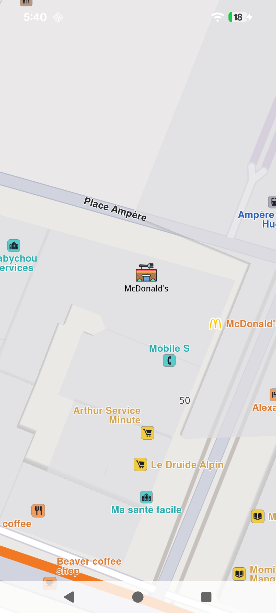
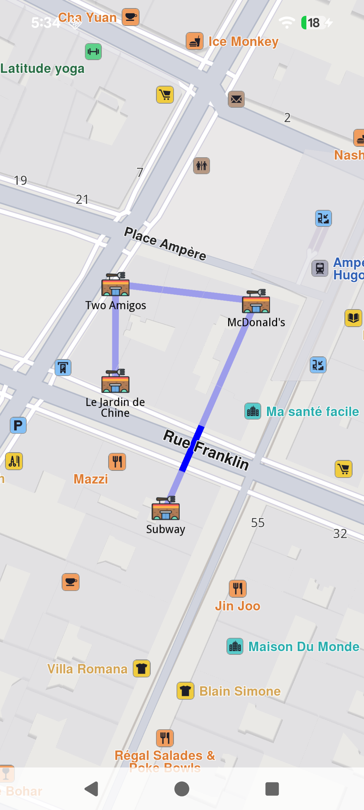
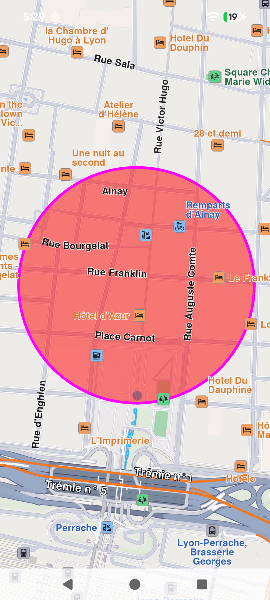

# Markers

A marker is a visual representation (such as an icon or a geometry, like a polyline or polygon) placed at a specific geographic location on a map to indicate an important point of interest, event, or location.

Markers can represent temporary or user-specified points on the map, such as user-defined locations, waypoints, or temporary annotations. While they are often represented by icons, they can also take the form of more complex geometries, like lines or shapes, depending on the context or requirements.

Markers typically contain only basic metadata, such as their position, title, or description, without extensive associated details.

By default, the map does not include any visual elements categorized as markers. Users have the ability to create and add markers to the map as needed.

## Instantiating Markers[​](#instantiating-markers "Direct link to Instantiating Markers")

Markers can be instantiated via:

1. **Default Initialization** : `UnlMarker()` creates a basic marker object.
2. **With UnlCoordinatesList** : `UnlMarker(coordinates: UnlCoordinatesList)` initializes a marker at specified geographic coordinates
3. **With UnlCoordinates and radius in meters** : `UnlMarker(coordinates: UnlCoordinates, radius: Int)` creates a circular marker centered at the given coordinates with a defined radius.
4. **With UnlCoordinates, horizontal radius, and vertical radius in meters** : `UnlMarker(coordinates: UnlCoordinates, horizRadius: Int, vertRadius: Int)` creates a rectangle marker centered at the specified coordinates with defined horizontal and vertical radii.

> 🚨 **Danger**
>
> Creating a marker does not automatically display it on the map. Ensure you set its coordinates and attach it to the desired map. Refer to the [Display markers guide](../04-Maps/05-Display%20Map%20Items/03-Display%20Markers.md) for detailed instructions.

## Types of Markers[​](#types-of-markers "Direct link to Types of Markers")

There are 3 types of markers:

* **Point markers** (each part is a group of points - array of coordinates)
* **Polyline markers** (each part is a polyline - array of coordinates)
* **Polygon markers** (each part is a polygon - array of coordinates)

The marker has methods for managing and manipulating markers on a map, including operations such as adding, updating, and deleting coordinates or parts.

A marker can be rendered in multiple ways on the map, either through default settings or user-specified rendering options:

* An image icon
* A polygon drawn with custom collors for border and shape.
* A polyline having an associated image at each point

Point marker

Polyline marker with point markers at each point

Polygon marker

## Customization options[​](#customization-options "Direct link to Customization options")

Markers offer extensive customization options through `UnlMarkerRenderSettings` class and `UnlMarkerCollectionRenderSettings`, enabling developers to tailor their appearance and behavior. Customizable features include:

* **Colors**: Modify the fill color, contour color, and text color to match the desired style.
* **Sizes**: Adjust dimensions such as line width, label size, and margins to fit specific requirements.
* **Labeling and Positioning**: Define custom labeling modes, reposition item or group labels, and adjust the alignment of labels and images relative to geographic coordinates.
* **Grouping Behavior**: Configure how multiple markers are grouped when located in proximity.
* **Icons**: Customize icons for individual markers or groups, including options for image fit and alignment.
* **Polyline and Polygon Textures**: Apply unique textures to polylines and polygons for enhanced visualization.

## Interaction with Markers[​](#interaction-with-markers "Direct link to Interaction with Markers")

### Selecting markers[​](#selecting-markers "Direct link to Selecting markers")

Markers are selectable by default, meaning user interactions, such as taps or clicks, can identify specific markers programmatically (e.g., through the function `mapview.cursorSelectionMarkers()`).

> 💡 **Tip**
>
> When cursor is hovering over a grouped marker cluster, the `mapview.cursorSelectionMarkers()` method will return the `MarkerMatchList` with a **group head marker**. See more about group head markers at UnlMarker Clustering.

The result is a `MarkerMatchList`. The `UnlMarkerMatch` item contains detailed information about the match:

* the matched `marker: UnlMarker`
* the marker's `type: EMarkerMatchType`
* the matched marker's `index: Int` in collection
* the matched `markerCollection: UnlMarkerCollection` of the marker
* the matched marker's `segment: Int`
* the matched position `coordinates: UnlCoordinates`
* the `distance: Int` from the matched position to the cursor position in meters

### Searching markers[​](#searching-markers "Direct link to Searching markers")

Markers are **not searchable**.

### Calculating route with marker[​](#calculating-route-with-marker "Direct link to Calculating route with marker")

Markers are **not** designed for route calculation.

> 💡 **Tip**
>
> To enable route calculation and navigation, create a new landmark using the relevant coordinates of the marker and a representative name and use that object for routing.

## Marker[​](#marker "Direct link to Marker")

| Name                                                                   | Type                    | Description                                                                                         |
| ---------------------------------------------------------------------- | ----------------------- | --------------------------------------------------------------------------------------------------- |
| `id`                                                                   | Long                    | Unique identifier for the marker.                                                                   |
| `name`                                                                 | String                  | Name of the marker.                                                                                 |
| `type`                                                                 | EMarkerType             | Type of the marker (Point, Polyline, Polygon).                                                      |
| `area`                                                                 | RectangleGeographicArea | The geographic area covered by the marker.                                                          |
| `partCount`                                                            | Int                     | Number of parts in the marker.                                                                      |
| `getCoordinates()`                                                     | UnlCoordinatesList         | Returns the coordinates of the marker.                                                              |
| `setCoordinates(coordinates: UnlCoordinatesList)`                         | Unit                    | Sets the coordinates of the marker.                                                                 |
| `set(center: UnlCoordinates, radius: Int)`                                | Unit                    | Sets the marker as a circle with the specified center and radius in meters.                         |
| `set(center: UnlCoordinates, horizontalRadius: Int, verticalRadius: Int)` | Unit                    | Sets the marker as an ellipse with the specified center and horizontal/vertical radii in meters.    |
| `set(corner1: UnlCoordinates, corner2: UnlCoordinates)`                      | Unit                    | Sets the marker as a rectangle defined by two corner coordinates.                                   |
| `add(coordinates: UnlCoordinates, index: Int, part: Int)`                 | Unit                    | Adds coordinates to the marker at the specified index and part.                                     |
| `add(latitude: Double, longitude: Double, index: Int, part: Int)`      | Unit                    | Adds coordinates to the marker using latitude and longitude values at the specified index and part. |

## MarkerCollection[​](#markercollection "Direct link to MarkerCollection")

The `UnlMarkerCollection` class is the main collection holding markers. All the markers within a collection have the same type and are styled in the same way.

| Name                                     | Type                    | Description                                                                                 |
| ---------------------------------------- | ----------------------- | ------------------------------------------------------------------------------------------- |
| `name`                                   | String                  | The name of the marker collection.                                                          |
| `size`                                   | Int                     | Returns the number of markers in the collection.                                            |
| `type`                                   | EMarkerType             | Retrieves the type of the marker collection.                                                |
| `area`                                   | RectangleGeographicArea | The geographic area enclosing all markers in the collection.                                |
| `markers`                                | ArrayList\<UnlMarker>?     | The list of markers in the collection.                                                      |
| `add(marker:UnlMarker,index:Int)`           | Unit                    | Adds a marker to the collection at a specific index (default is the end of the collection). |
| `del(index: Int)`                        | Unit                    | Deletes a marker from the collection by index.                                              |
| `clear()`                                | Unit                    | Deletes all markers from the collection.                                                    |
| `getMarkerAt(index:Int)`                 | UnlMarker                  | Returns the marker at a specific index or an empty marker if the index is invalid.          |
| `getMarkerById(markerId:Long)`           | UnlMarker                  | Retrieves a marker by its unique ID.                                                        |
| `getPointsGroupHead(groupId:Long)`       | UnlMarker                  | Retrieves the head of a points group for a given marker ID.                                 |
| `getPointsGroupComponents(groupId:Long)` | ArrayList\<UnlMarker>?     | Retrieves the components of a points group by its ID.                                       |
| `save(buffer: DataBuffer)`               | Int                     | Serializes the collection and adds it to a DataBuffer.                                      |
