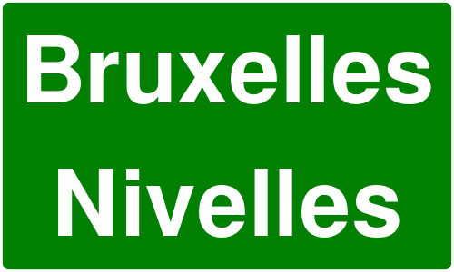
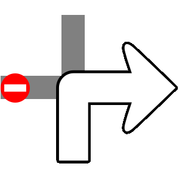
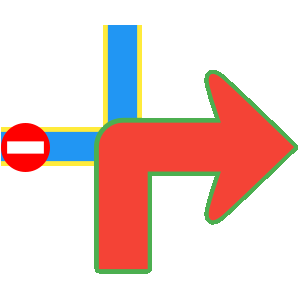

# Routes

A Route usually represents a navigable path between two or more landmarks (waypoints). It includes data such as distance, estimated time, and navigation instructions.

Routes can be computed in different ways:

* Based on 2 or more intermediary landmarks (waypoints) - route is navigable.
* Over-track routes (based on a predefined `path`, which could come from a GPX file but is not limited to this) are navigable.
* Route ranges: These routes are **not** navigable and do not have segments or instructions.

A navigable route consists of one or more segments. Each segment represents the portion of the route between two consecutive waypoints and includes its own set of route instructions.

## Instantiating Routes[​](#instantiating-routes "Direct link to Instantiating Routes")

Routes cannot be instantiated directly. Instead, they must be computed based on a predefined list of landmarks. For detailed guidance on how to calculate routes, refer to the [Getting Started with Routing Guide](../07-Routing/02-Get%20Started%20with%20Routing.md).

> 🚨 **Danger**
>
>Calculating a route does not automatically display it on the map. Refer to the [Display markers guide](../04-Maps/05-Display%20Map%20Items/03-Display%20Markers.md) for detailed instructions on how to display one or more routes.

## Route specializations[​](#route-specializations "Direct link to Route specializations")

There are 2 special types of routes:

1. **Normal Routes** - Standard routes computed for typical navigation scenarios.

2. **Public Transport (PT) Routes** - Routes calculated using a public transport mode, including additional details such as service frequency, ticket purchase information, and other transit-specific data.

### Specific Classes[​](#specific-classes "Direct link to Specific Classes")

Each route type is associated with specific classes that offer functionality suited to its requirements:

| **Route Type**         | **Route Class** | **Segment Class** | **Instruction Class** |
| ---------------------- | --------------- | ----------------- | --------------------- |
| Normal Route           | `UnlRoute`         | `UnlRouteSegment`    | `UnlRouteInstruction`    |
| Public Transport Route | `UnlPTRoute`       | `UnlPTRouteSegment`  | `UnlPTRouteInstruction`  |

## Route structure[​](#route-structure "Direct link to Route structure")

| Field             | Type          | Explanation        |
| ------------------------------------------------------------------------------------ | ----------------------------- | ---------------------------------------------------------------------------------------------------------------- |
| `dominantRoads`                                                                      | ArrayList\<String>?           | Dominant road names. If a road has multiple names, they will be presented as "name1 / name2 / ... / namex".      |
| `extraInfo`                                                                          | `ParameterList?`              | Direct access to the extra info attached to this route.                                                          |
| `preferences`                                                                        | `UnlRoutePreferences?`           | UnlRoute preferences.                                                                                               |
| `routeListener`                                                                      | `IRouteListener?`             | Route-related events listener.                                                                                   |
| `segments`                                                                           | `ArrayList<UnlRouteSegment>?`    | UnlRoute segments.                                                                                                  |
| `status`                                                                             | `ERouteStatus`                | UnlRoute status.                                                                                                    |
| `summary`                                                                            | String?                       | Summary of the route segment.                                                                                    |
| `hasTollRoads()`                                                                     | Boolean                       | Returns true if the route contains toll roads.                                                                   |
| `hasIncursCosts()`                                                                   | Boolean                       | Checks if traveling the route or route segment incurs cost to the user.                                          |
| `hasFerryConnections()`                                                              | Boolean                       | Returns true if the route contains ferry connections.                                                            |
| `isPTRoute()`                                                                        | Boolean                       | Returns true if the route is a Public Transport route.                                                           |
| `toPTRoute()`                                                                        | `UnlPTRoute?`                    | Convert route to a Public Transport route.                                                                       |
| `getTimeDistance(activePart = true)`                                                 | `UnlTimeDistance?`               | If activePart is true, returns only the active part of the route metrics; if false, returns whole route metrics. |
| `getCoordinateOnRoute(distance : Int)`                                               | `UnlCoordinates?`                | Gets a coordinate on the route at the given distance.                                                            |
| `getDistanceOnRoute(coordinates :UnlCoordinates, activePart : Boolean)`                 | Int                           | Gets route distance from departure at the given coordinate.                                                      |
| `getClosestSegment(coordinates :UnlCoordinates)`                                        | Int                           | Gets the index of the closest route segment to the given coordinates.                                            |
| `getPath()`                                                                          | `UnlPath?`                       | Builds a path from the route start to the end segment.                                                           |
| `getTimeDistanceCoordinates(start : Int, step : Int, end : Int, stepType : Boolean)` | `UnlTimeDistanceCoordinateList?` | Builds a list of timestamp coordinates from a route.                                                             |

## Route segment structure[​](#route-segment-structure "Direct link to Route segment structure")

A route segment represents the portion of a route between two consecutive waypoints. For public transport routes, segments are further categorized as either pedestrian sections or public transit sections, depending on the mode of travel within that segment.

| Method                       | Return Type                    | Description          |
| ---------------------------- | ------------------------------ | ------------------------------------------------------------------------------------------------------------------------------------------------------------------------------------------------- |
| `geographicArea`             | RectangleGeographicArea?       | Geographic area of the route. The geographic area is the smallest rectangle that can be drawn around the route.                                                                                   |
| `instructions`               | `ArrayList<UnlRouteInstruction>?` | Get route instructions list.                                                                                                                                                                      |
| `summary`                    | String?                        | Summary of the route segment.                                                                                                                                                                     |
| `timeDistance`               | `UnlTimeDistance?`                | Length in meters and estimated travel time in seconds for the route / route segment.                                                                                                              |
| `waypoints`                  | `UnlLandmarkList?`                | List of waypoints. The waypoints are ordered like: departure, first waypoint, ..., destination. Only the route can have intermediate waypoints. The segments have only departure and destination. |
| `hasIncursCosts()`           | Boolean                        | Method to check if traveling the route or route segment incurs cost to the user.                                                                                                                  |
| `isCommon()`                 | Boolean                        | Check if this segment is of common type.                                                                                                                                                          |
| `isPublicTransportSegment()` | Boolean                        | Check if this segment is public transport type.                                                                                                                                                   |
| `toPTRouteSegment()`         | `UnlPTRouteSegment?`              | Convert to a UnlPTRouteSegment.                                                                                                                                                                      |

## Route instruction structure[​](#route-instruction-structure "Direct link to Route instruction structure")

A `UnlRouteInstruction` provides detailed guidance for navigation, offering various methods to retrieve specific information about each maneuver the user needs to make, such as coordinates, turn directions, distances and time to next waypoints.

| Method                                      | Return Type              | Description                                                                           |
| ------------------------------------------- | ------------------------ | ------------------------------------------------------------------------------------- |
| `countryCodeISO`                            | String?                  | Country code in ISO format.                                                           |
| `coordinates`                               | `UnlCoordinates?`           | UnlCoordinates of the instruction.                                                       |
| `turnDetails`                               | `UnlTurnDetails?`           | Turn details.                                                                         |
| `turnInstruction`                           | String?                  | Turn instruction text.                                                                |
| `turnImage`                                 | `UnlImage?`                 | The image for the turn. The API client should check if the image is valid.            |
| `followRoadInstruction`                     | String?                  | Follow road instruction text.                                                         |
| `roadInfo`                                  | `ArrayList<RoadInfo>?`   | Road information list.                                                                |
| `roadInfoImage`                             | `RoadInfoImage?`         | Road info image.                                                                      |
| `signpostDetails`                           | `SignpostDetails?`       | Signpost details.                                                                     |
| `signpostInstruction`                       | String?                  | Signpost instruction text.                                                            |
| `realisticNextTurnImage`                    | `AbstractGeometryImage?` | UnlImage for the realistic next turn. The API client should check if the image is valid. |
| `timeDistanceToNextTurn`                    | `UnlTimeDistance?`          | UnlTime/distance to next turn.                                                           |
| `remainingTravelTimeDistance`               | `UnlTimeDistance?`          | Remaining travel time/distance.                                                       |
| `remainingTravelTimeDistanceToNextWaypoint` | `UnlTimeDistance?`          | Remaining time/distance to next waypoint.                                             |
| `traveledTimeDistance`                      | `UnlTimeDistance?`          | Traveled time/distance.                                                               |
| `hasTurnInfo()`                             | Boolean                  | Check if turn information is available.                                               |
| `hasFollowRoadInfo()`                       | Boolean                  | Check if follow road information is available.                                        |
| `hasSignpostInfo()`                         | Boolean                  | Check if signpost information is available.                                           |
| `hasRoadInfo`                               | Boolean                  | Check if road information is available.                                               |
| `isFerry()`                                 | Boolean                  | Check if this is a ferry.                                                             |
| `isTollRoad()`                              | Boolean                  | Check if this is a toll road.                                                         |
| `isCommon()`                                | Boolean                  | Check if this instruction is of common type.                                          |
| `toPTRouteInstruction()`                    | `UnlPTRouteInstruction?`    | Casts this Route instruction to a Public transport instruction.                       |

## Other classes[​](#other-classes "Direct link to Other classes")

### UnlTime distance[​](#time-distance "Direct link to UnlTime distance")

The UnlTimeDistance class is used to get details about the time and distance to/from certain important points of interests.

The UnlTimeDistance class differentiates between unrestricted and restricted road portions. Restricted segments refer to non-public roads, while unrestricted represent publicly accessible roads:

| Property/Method         | Type      | Explanation              |
| ------------------------------------------------------------------------------------------------------------------------------------------ | --------- | ------------------------------------------------------------------------------------------ |
| `totalTime`                                                                                                                                | `Int`     | Total time in seconds (sum of unrestricted and restricted times).                          |
| `restrictedTime`                                                                                                                           | `Int`     | Restricted time in seconds.                                                                |
| `restrictedBeginEndRatio`                                                                                                                  | `Double`  | Ratio representing the division of restricted time/distance between the begin and the end. |
| `restrictedDistance`                                                                                                                       | `Int`     | Restricted distance in meters.                                                             |
| `restrictedDistanceAtBegin`                                                                                                                | `Int`     | Restricted distance allocated to the beginning, based on the ratio.                        |
| `restrictedDistanceAtEnd`                                                                                                                  | `Int`     | Restricted distance allocated to the end, based on the ratio.                              |
| `restrictedTimeAtBegin`                                                                                                                    | `Int`     | Restricted time allocated to the beginning, based on the ratio.                            |
| `restrictedTimeAtEnd`                                                                                                                      | `Int`     | Restricted time allocated to the end, based on the ratio.                                  |
| `totalDistance`                                                                                                                            | `Int`     | Total distance in meters (sum of unrestricted and restricted distances).                   |
| `unrestrictedDistance`                                                                                                                     | `Int`     | Unrestricted distance in meters.                                                           |
| `hasRestrictedBeginEndDifferentiation()`                                                                                                   | `Boolean` | Indicates if the begin and end have differentiated restricted values based on the ratio.   |
| `assign(unrestrictedTimeS : Int, unrestrictedDistanceM : Int, restrictedTimeS : Int, restrictedDistanceM : Int, ndBeginEndRatio : Double)` | `Unit`    | Assigns values to the UnlTimeDistance object.                                                 |
| `isEmpty()`                                                                                                                                | `Boolean` | Indicates whether the total time is zero.                                                  |

### Signpost details[​](#signpost-details "Direct link to Signpost details")

Signposts near roadways typically indicate intersections and directions to various destinations. The SDK provides realistic renderings of these signposts, along with relevant supplementary information.

Below is an example of a rendered signpost details image:



Signpost image captured during highway navigation

<br />

The `SignpostDetails` class also provides properties such as:

| Property/Method        | Type                       | Description                                                               |
| ---------------------- | -------------------------- | ------------------------------------------------------------------------- |
| `image`                | `SignpostImage?`           | Returns the signpost image representation.                                |
| `hasBackgroundColor()` | `Boolean`                  | Indicates whether the signpost has a background color.                    |
| `backgroundColor`      | `Rgba?`                    | Retrieves the background color of the signpost.                           |
| `hasBorderColor()`     | `Boolean`                  | Indicates whether the signpost has a border color.                        |
| `borderColor`          | `Rgba?`                    | Retrieves the border color of the signpost.                               |
| `hasTextColor()`       | `Boolean`                  | Indicates whether the signpost has a text color.                          |
| `textColor`            | `Rgba?`                    | Retrieves the text color of the signpost.                                 |
| `items`                | `ArrayList<SignpostItem>?` | Retrieves a list of `SignpostItem` elements associated with the signpost. |

#### Signpost item[​](#signpost-item "Direct link to Signpost item")

Each `SignpostItem` has the following properties:

| Property/Method        | Type                     | Description                                                                            |
| ---------------------- | ------------------------ | -------------------------------------------------------------------------------------- |
| `column`               | `Int`                    | Retrieves the one-based column of the item. Zero indicates not applicable.             |
| `connectionInfo`       | `SignpostConnectionInfo` | Retrieves the connection type of the item (branch, towards, exit, invalid)             |
| `phoneme`              | `String`                 | Retrieves the phoneme assigned to the item if available, otherwise empty.              |
| `pictogramType`        | `SignpostPictogramType`  | Retrieves the pictogram type for the item (airport, busStation, parkingFacility, etc). |
| `row`                  | `Int`                    | Retrieves the one-based row of the item. Zero indicates not applicable.                |
| `shieldType`           | `RoadShieldType`         | Retrieves the shield type for the item (county, state, federal, interstate, etc)       |
| `text`                 | `String`                 | Retrieves the text assigned to the item, if available.                                 |
| `type`                 | `SignpostItemType`       | Retrieves the type of the item (placeName, routeNumber, routeName, etc).               |
| `hasAmbiguity()`       | `Boolean`                | Indicates if the item has ambiguity. Avoid using such items for TTS.                   |
| `hasSameShieldLevel()` | `Boolean`                | Indicates if the road code item has the same shield level as its road.                 |

### Turn Details[​](#turn-details "Direct link to Turn Details")

The `UnlTurnDetails` class provides details such as:

| Property                | Type                     | Description                                               |
| ----------------------- | ------------------------ | --------------------------------------------------------- |
| `abstractGeometry`      | `AbstractGeometry?`      | Returns the abstract geometry representation of the turn. |
| `abstractGeometryImage` | `AbstractGeometryImage?` | Returns the abstract geometry image for the turn.         |
| `event`                 | `EUnlTurnEvent`             | Returns the turn event type.                              |
| `roundaboutExitNumber`  | `Int`                    | Returns the exit number for roundabout turns.             |

#### Turn details abstract image vs. turn image:[​](#turn-details-abstract-image-vs-turn-image "Direct link to Turn details abstract image vs. turn image:")

The difference between images obtained via `abstractGeometryImg` (left) and `turnImage` (right) is shown below:

| **Turn details abstract image** | **Turn image**|
| :---: | :---: |
|  |  |

<br />
 
* **abstractGeometryImg**: Provides a detailed representation of the entire intersection, offering a comprehensive view of the turn geometry. This image can be customized, including options to adjust various colors for better visual alignment with the application's theme.
* **turnImage**: Delivers a simplified schematic of the upcoming turn, focusing solely on the essential turn direction. Unlike abstractGeometryImg, this method does not support customization.

> 💡 **Tip**
>
> Each image is assigned a unique identifier. You can use the `uid` getter of the images classes to retrieve this id and update the image in the UI only when the ID changes. This strategy can significantly enhance performance during navigation, especially in scenarios where frequent updates might otherwise impact efficiency.

#### Abstract geometry image customization[​](#abstract-geometry-image-customization "Direct link to Abstract geometry image customization")

The `AbstractGeometryImageRenderSettings` allows for abstract geometry render settings customization, with the possibility of specifying the colors, improving the overall user experience:

* Kotlin
* Java

```kotlin
// Kotlin
val settings = AbstractGeometryImageRenderSettings().apply {
    activeInnerColor = Rgba.red()
    activeOuterColor = Rgba.green()
    inactiveInnerColor = Rgba.blue()
    inactiveOuterColor =Rgba.yellow()
}

```

```java
// Java
AbstractGeometryImageRenderSettings settings = new AbstractGeometryImageRenderSettings();
settings.setActiveInnerColor(Rgba.red());
settings.setActiveOuterColor(Rgba.green());
settings.setInactiveInnerColor(Rgba.blue());
settings.setInactiveOuterColor(Rgba.yellow());

```

The render settings from above will create the following image when used:



Customized next turn details abstract image

#### Turn events[​](#turn-events "Direct link to Turn events")

`EUnlTurnEvent` is an enumeration that defines various types of turn events that can occur during navigation. These events help in providing accurate and context-aware navigation instructions to users. The different turn events are:

* **NotAvailable** - No turn information available
* **Straight** - Continue straight ahead
* **Right** - Turn right
* **Right1** - Turn right (variant 1)
* **Right2** - Turn right (variant 2)
* **Left** - Turn left
* **Left1** - Turn left (variant 1)
* **Left2** - Turn left (variant 2)
* **LightLeft** - Slight left turn
* **LightLeft1** - Slight left turn (variant 1)
* **LightLeft2** - Slight left turn (variant 2)
* **LightRight** - Slight right turn
* **LightRight1** - Slight right turn (variant 1)
* **LightRight2** - Slight right turn (variant 2)
* **SharpRight** - Sharp right turn
* **SharpRight1** - Sharp right turn (variant 1)
* **SharpRight2** - Sharp right turn (variant 2)
* **SharpLeft** - Sharp left turn
* **SharpLeft1** - Sharp left turn (variant 1)
* **SharpLeft2** - Sharp left turn (variant 2)
* **RoundaboutExitRight** - Exit roundabout to the right
* **Roundabout** - Enter roundabout
* **RoundRight** - Round right maneuver
* **RoundLeft** - Round left maneuver
* **ExitRight** - Exit to the right
* **ExitRight1** - Exit to the right (variant 1)
* **ExitRight2** - Exit to the right (variant 2)
* **InfoGeneric** - Generic information
* **DriveOn** - Continue driving
* **ExitNo** - No exit
* **ExitLeft** - Exit to the left
* **ExitLeft1** - Exit to the left (variant 1)
* **ExitLeft2** - Exit to the left (variant 2)
* **RoundaboutExitLeft** - Exit roundabout to the left
* **IntoRoundabout** - Enter into roundabout
* **StayOn** - Stay on current road
* **BoatFerry** - Take boat ferry
* **RailFerry** - Take rail ferry
* **InfoLane** - Lane information
* **InfoSign** - Sign information
* **LeftRight** - Left then right maneuver
* **RightLeft** - Right then left maneuver
* **KeepLeft** - Keep to the left
* **KeepRight** - Keep to the right
* **Start** - Start of route
* **Intermediate** - Intermediate waypoint
* **Stop** - End of route

## Change the language of the instructions[​](#change-the-language-of-the-instructions "Direct link to Change the language of the instructions")

The texts used in route instructions and related classes follow the language set in the SDK. See [the internationalization guide](../01-Overview/04-Todo.md) for more details.
