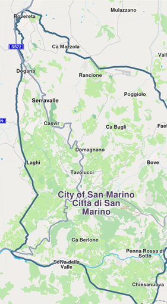

# Get started with maps

The Navigation SDK for Android delivers powerful mapping capabilities, enabling developers to effortlessly integrate dynamic map views into their applications. Core features include embedding and customizing map views, controlling displayed locations, and fine-tuning map properties. At the center of the mapping API is the `UnlMapSurfaceView` class, which serves as the primary component for rendering maps and handling user interactions.

## Display a map[​](#display-a-map "Direct link to Display a map")

See the [Code Implementation section from Create your first app guide](../02-Get%20Started/03-Create%20Your%20First%20App.md#implement-the-application-code) for a complete example of displaying a basic map in your application.



**Displaying a default day map**

<br />

## UnlMapSurfaceView[​](#UnlMapSurfaceView "Direct link to UnlMapSurfaceView")

The `UnlMapSurfaceView` class is the primary component for displaying maps in an Android application. It extends `GLSurfaceView` and provides a complete OpenGL rendering surface for map display with built-in touch interaction handling.

### Key Features[​](#key-features "Direct link to Key Features")

* **Automatic SDK Initialization**: If UnlSdk isn't initialized, the surface automatically calls `UnlSdk.initSdkWithDefaults()` when attached to a window
* **Default UnlMapView Creation**: Creates a default `UnlMapView` automatically unless disabled
* **Touch Event Handling**: Built-in support for pan, zoom, and other map interactions
* **Lifecycle Management**: Automatic resource management with configurable cleanup behavior
* **OpenGL Context Management**: Handles EGL context creation and configuration

### Properties[​](#properties "Direct link to Properties")

| Property                   | Type                        | Description               |
| -------------------------- | --------------------------- | ---------------------------------------------------------- |
| `gemGlContext`             | `OpenGLContext?`            | The OpenGL context created by this surface                 |
| `gemScreen`                | `Screen?`                   | The screen object for rendering operations                 |
| `mapView`                  | `UnlMapView?`                  | The default UnlMapView instance (if auto-creation is enabled) |
| `hadBeenInitialized`       | `Boolean`                   | Flag indicating if this instance has been initialized      |
| `hadBeenReleased`          | `Boolean`                   | Flag indicating if this instance has been released         |
| `visibilityChangeListener` | `VisibilityChangeListener?` | Listener for visibility change events                      |

### Callback Functions[​](#callback-functions "Direct link to Callback Functions")

| Callback                    | Description         |
| --------------------------- | ------------------------------------------------------------------------------------------------------------ |
| `onInitSdk`                 | Called when the view is about to initialize the SDK. If provided, user is responsible for SDK initialization |
| `onSdkInitSucceeded`        | Triggered after successful SDK initialization                                                                |
| `onScreenCreated`           | Called after the OpenGL screen has been successfully created                                                 |
| `onDefaultMapViewCreated`   | Triggered after the default UnlMapView has been created                                                         |
| `onPreHandleTouchListener`  | Called before the screen handles touch events                                                                |
| `onPostHandleTouchListener` | Called after the screen handles touch events                                                                 |
| `onDrawFrameCustom`         | Custom drawing operations on the OpenGL thread                                                               |

### XML Attributes[​](#xml-attributes "Direct link to XML Attributes")

You can configure `UnlMapSurfaceView` behavior using XML attributes:

```xml
<com.unlmap.sdk.core.UnlMapSurfaceView
    android:layout_width="match_parent"
    android:layout_height="match_parent"
    app:createDefaultMapView="true"
    app:autoReleaseOnDetachedFromWindow="true"
    app:sdkToken="your_sdk_service_key" />

```


| Attribute                         | Type      | Default | Description                |
| --------------------------------- | --------- | ------- | -------------------------------------------------------- |
| `createDefaultMapView`            | `Boolean` | `true`  | Whether to automatically create a default UnlMapView        |
| `autoReleaseOnDetachedFromWindow` | `Boolean` | `true`  | Whether to automatically release resources when detached |
| `sdkToken`                        | `String`  | `null`  | SDK authorization token                                  |


### Methods[​](#methods "Direct link to Methods")

| Method                    | Description                   |
| ------------------------- | ------------------------------------------------------------------ |
| `release()`               | Releases the drawing context and associated resources              |
| `releaseDefaultMapView()` | Releases only the default UnlMapView while keeping the surface active |


### Usage Example[​](#usage-example "Direct link to Usage Example")

* Kotlin
* Java

```kotlin
// Kotlin
// In your Activity or Fragment
val UnlMapSurfaceView = findViewById<UnlMapSurfaceView>(R.id.UnlMapSurfaceView)

// Configure callbacks
UnlMapSurfaceView.onDefaultMapViewCreated = { mapView ->
    // Configure your map view
    mapView.centerOnCoordinates(coordinates, zoomLevel)
}

UnlMapSurfaceView.onSdkInitSucceeded = {
    // SDK is ready
    Log.d("Map", "SDK initialized successfully")
}

// Add to your layout
parentLayout.addView(UnlMapSurfaceView)

```

```java
// Java
// In your Activity or Fragment
UnlMapSurfaceView UnlMapSurfaceView = findViewById(R.id.UnlMapSurfaceView);

// Configure callbacks
UnlMapSurfaceView.setOnDefaultMapViewCreated(mapView -> {
    // Configure your map view
    mapView.centerOnCoordinates(coordinates, zoomLevel);
});

UnlMapSurfaceView.setOnSdkInitSucceeded(() -> {
    // SDK is ready
    Log.d("Map", "SDK initialized successfully");
});

// Add to your layout
parentLayout.addView(UnlMapSurfaceView);

```

### Programmatic Creation[​](#programmatic-creation "Direct link to Programmatic Creation")

* Kotlin
* Java

```kotlin
// Kotlin
val UnlMapSurfaceView = UnlMapSurfaceView(
    context = this,
    doCreateDefaultMapView = true,
    sdkToken = "your_sdk_service_key",
    autoReleaseOnDetachedFromWindow = true,
    postLambdasOnMain = true
)

```

```java
// Java
UnlMapSurfaceView UnlMapSurfaceView = new UnlMapSurfaceView(
    this,
    true,  // doCreateDefaultMapView
    "your_sdk_service_key",
    true,  // autoReleaseOnDetachedFromWindow
    true   // postLambdasOnMain
);

```

