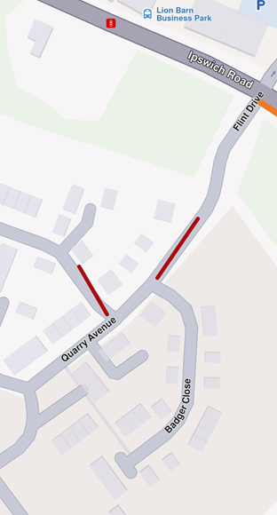
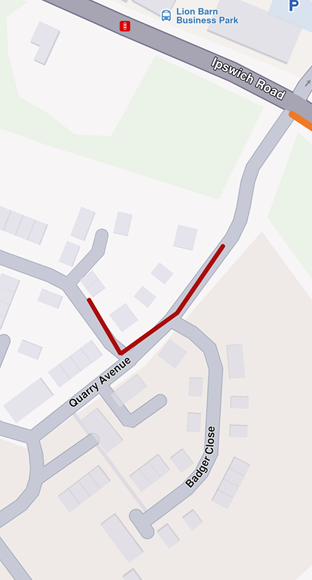
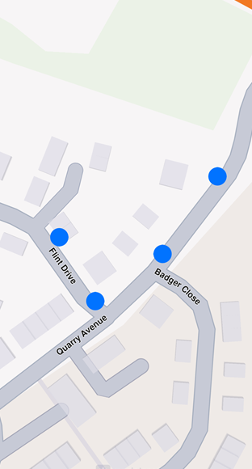
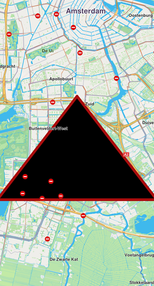
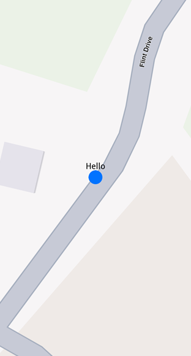
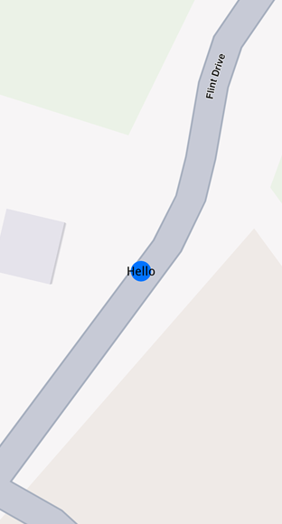
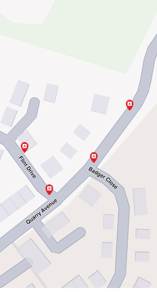
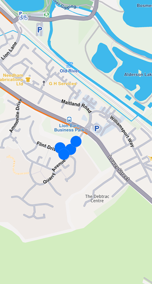
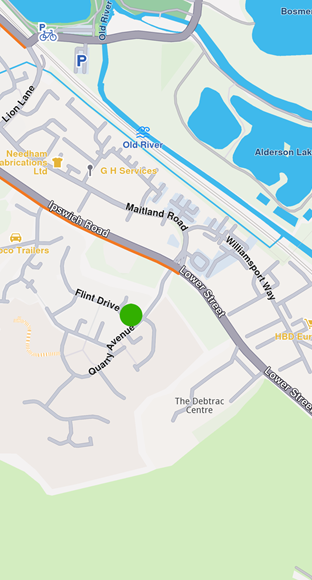

# Display markers

The base class for the marker hierarchy is `UnlMarker`. It encapsulates coordinates assigned to a specific part. Multiple coordinates can be added to the same marker and be separated into different parts. If no part is specified, the coordinates are added to a default part, indexed as 0. The coordinates are stored in a list-like structure, where you can specify their index explicitly. By default, the index is set to -1, meaning the coordinate will be appended to the end of the list.



Displaying a marker with coordinates separated into different parts

<br/>



Displaying a marker with coordinates added to same part

<br />

* Kotlin
* Java

```kotlin
// Kotlin
// code used for displaying a marker with coordinates separated into different parts
val marker1 = UnlMarker().apply {
    add(UnlCoordinates(52.1459, 1.0613), part = 0)
    add(UnlCoordinates(52.14569, 1.0615), part = 0)
    add(UnlCoordinates(52.14585, 1.06186), part = 1)
    add(UnlCoordinates(52.14611, 1.06215), part = 1)
}

```

```java
// Java
// code used for displaying a marker with coordinates separated into different parts
UnlMarker marker1 = new UnlMarker();
marker1.add(new UnlCoordinates(52.1459, 1.0613), 0);
marker1.add(new UnlCoordinates(52.14569, 1.0615), 0);
marker1.add(new UnlCoordinates(52.14585, 1.06186), 1);
marker1.add(new UnlCoordinates(52.14611, 1.06215), 1);

```

* Kotlin
* Java

```kotlin
// Kotlin
// code used for displaying a marker with coordinates added to the same part
val marker1 = UnlMarker().apply {
    add(UnlCoordinates(52.1459, 1.0613), part = 0)
    add(UnlCoordinates(52.14569, 1.0615), part = 0)
    add(UnlCoordinates(52.14585, 1.06186), part = 0)
    add(UnlCoordinates(52.14611, 1.06215), part = 0)
}

```

```java
// Java
// code used for displaying a marker with coordinates added to the same part
UnlMarker marker1 = new UnlMarker();
marker1.add(new UnlCoordinates(52.1459, 1.0613), 0);
marker1.add(new UnlCoordinates(52.14569, 1.0615), 0);
marker1.add(new UnlCoordinates(52.14585, 1.06186), 0);
marker1.add(new UnlCoordinates(52.14611, 1.06215), 0);

```

To display any type of marker on a map, it must first be added to a `UnlMarkerCollection`. Creating a collection of markers requires providing a name and specifying the desired `EMarkerType` enum as parameters for its constructor. The collection of markers displayed above used `EMarkerType.Polyline`, but it can also be `EMarkerType.Point` or `EMarkerType.Polygon`.

Once the `UnlMarkerCollection` object has been populated, it must be added to the `MapViewMarkerCollections` field within the `UnlMapViewPrefernces` class. This can be accessed through the `UnlMapView`, as shown below:

* Kotlin
* Java

```kotlin
// Kotlin
mapView.preferences?.markers?.add(markerCollection)

```

```java
// Java
if (mapView.getPreferences() != null) {
    mapView.getPreferences().getMarkers().add(markerCollection);
}

```

### Point Type UnlMarker[​](#point-type-marker "Direct link to Point Type UnlMarker")

Visually represented as an icon, it is used to dynamically highlight user-defined locations. To display a point-type marker, the `UnlMarkerCollection` to which the markers are added must be of the `EMarkerType.Point` type.

* Kotlin
* Java

```kotlin
// Kotlin
val marker = UnlMarker().apply {
    add(UnlCoordinates(52.1459, 1.0613), part = 0)
    add(UnlCoordinates(52.14569, 1.0615), part = 0)
    add(UnlCoordinates(52.14585, 1.06186), part = 1)
    add(UnlCoordinates(52.14611, 1.06215), part = 1)
}

val markerCollection = UnlMarkerCollection(EMarkerType.Point, "myCollection")

markerCollection.add(marker)

mapView.preferences?.markers?.add(markerCollection)
mapView.centerOnArea(markerCollection.area)

```

```java
// Java
UnlMarker marker = new UnlMarker();
marker.add(new UnlCoordinates(52.1459, 1.0613), 0);
marker.add(new UnlCoordinates(52.14569, 1.0615), 0);
marker.add(new UnlCoordinates(52.14585, 1.06186), 1);
marker.add(new UnlCoordinates(52.14611, 1.06215), 1);

UnlMarkerCollection markerCollection = new UnlMarkerCollection(EMarkerType.Point, "myCollection");

markerCollection.add(marker);

if (mapView.getPreferences() != null) {
    mapView.getPreferences().getMarkers().add(markerCollection);
}
mapView.centerOnArea(markerCollection.getArea());

```

The result will be the following:



Displaying point-type markers on map

<br />

> ⚠️ **Warning**
>
> By default, point-type markers appear as blue circles up to a specific zoom level. When the zoom threshold is exceeded, they automatically cluster into orange circles, and at higher levels of clustering, they transition to red circles. Learn more at [UnlMarker Clustering](../04-Maps/05-Display%20Map%20Items/03-Display%20Markers.md#marker-clustering)

### Polyline Type UnlMarker[​](#polyline-type-marker "Direct link to Polyline Type UnlMarker")

This type of marker is designed to display a continuous line consisting of one or more connected straight-line segments. To use it, ensure the `UnlMarkerCollection` specifies `type` as `EMarkerType.Polyline`. It's important to note that markers can include multiple coordinates, which may or may not belong to the same part. UnlCoordinates within the same part are connected by a polyline, which is red by default, while coordinates outside the part remain unconnected.

For more information, see [Markers section](../03-Core/05-Markers.md#types-of-markers).

### Polygon Type UnlMarker[​](#polygon-type-marker "Direct link to Polygon Type UnlMarker")

This type of marker is designed to display a closed two-dimensional figure composed of straight-line segments that meet at their endpoints. To use it, ensure the `UnlMarkerCollection` specifies `type` as `EMarkerType.Polygon`.



Polygon drawn between three coordinates

<br />

> 📝 **Info**
>
> To successfully create a polygon, at least three coordinates must be added to the same part. Otherwise, the result will be an open polyline rather than a closed shape.

Polygons can be customized using properties like `polygonFillColor`. Additionally, since polygon edges are essentially polylines, you can further refine their appearance with polyline-related attributes such as `polylineInnerColor`, `polylineOuterColor`, `polylineInnerSize`, and `polylineOuterSize`.

### UnlMarker Customizations[​](#marker-customizations "Direct link to UnlMarker Customizations")

To customize the appearance of markers on the map, you can use the `UnlMarkerCollectionRenderSettings` class.

This class is designed for customizing the appearance of individual markers. It includes various fields that can influence a marker's appearance, regardless of its type, as it provides customizable features for all marker types. For example:

* For markers of type `EMarkerType.Polyline`, you can use fields such as `polylineInnerColor`, `polylineOuterColor`, `polylineInnerSize`, and `polylineOuterSize`.
* For `EMarkerType.Polygon`, the `polygonFillColor` fields are available, among others.
* For `EMarkerType.Point`, you can use fields such as `labelTextColor`, `labelTextSize`, `image`, `imageSize`.

All dimensional sizes (`imageSize`, `labelTextSize`, etc.) are measured in millimeters.

> 📝 **Info**
>
> If customizations unrelated to a marker's specific type are applied - for example, using `polylineInnerColor` for a `EMarkerType.Point`-they will simply be ignored, and the marker's appearance will remain unaffected.

For `EMarkerType.Point`, a key customizable field is `labelingMode`. This field uses values from `EMarkerLabelingMode` enum. This allows you to enable desired features, such as positioning the label text above the icon by setting the appropriate labeling mode as shown below:

* Kotlin
* Java

```kotlin
// Kotlin
val renderSettings = UnlMarkerCollectionRenderSettings().apply {
    labelingMode = EMarkerLabelingMode.Item
    //labelingMode = EMarkerLabelingMode.ItemCenter
}

mapView.preferences?.markers?.add(markerCollection, renderSettings)

```

```java
// Java
UnlMarkerCollectionRenderSettings renderSettings = new UnlMarkerCollectionRenderSettings();
renderSettings.setLabelingMode(EMarkerLabelingMode.Item);
//renderSettings.setLabelingMode(EMarkerLabelingMode.ItemCenter);

if (mapView.getPreferences() != null) {
    mapView.getPreferences().getMarkers().add(markerCollection, renderSettings);
}

```

> 📝 **Info**
>
> To hide a marker's name or its group's name, create a `UnlMarkerCollectionRenderSettings` object with a `labelingMode` that excludes `EMarkerLabelingMode.Item` and `EMarkerLabelingMode.Group`. By default, both options are enabled.

The above code will result in the following marker appearance:



Displaying a marker with text above icon



Displaying a marker with text centered on icon

<br />

> 📝 **Info**
>
> To assign a name to a marker, use the `name` property of the `UnlMarker` class.

To customize the icons of the displayed markers, add the collection to `MapViewMarkerCollections` and configure a `UnlMarkerCollectionRenderSettings` instance with the relevant image field. This field controls the appearance of the entire collection.

* Kotlin
* Java

```kotlin
// Kotlin
val imageData = assets.open("poi83.png").readBytes()
val image = UnlImage.produceWithData(imageData)

val renderSettings = UnlMarkerCollectionRenderSettings().apply {
    this.image = image
}

```

```java
// Java
byte[] imageData = getAssets().open("poi83.png").readAllBytes();
UnlImage image = UnlImage.produceWithData(imageData);

UnlMarkerCollectionRenderSettings renderSettings = new UnlMarkerCollectionRenderSettings();
renderSettings.setImage(image);

```

Code above is setting a custom icon to a marker. The result is the following:



Displaying point-type markers with render settings

#### UnlMarker Sketches[​](#marker-sketches "Direct link to UnlMarker Sketches")

To customize the appearance of each marker individually, use the `MarkerSketches` class, which extends `UnlMarkerCollection`. This lets you define unique styles and properties for every marker. You can obtain a MarkerSketches object using the `MapViewMarkerCollections.sketches()` method:

* Kotlin
* Java

```kotlin
// Kotlin
val sketches = mapView.preferences?.markers?.sketches(EMarkerType.Point)

```

```java
// Java
MarkerSketches sketches = null;
if (mapView.getPreferences() != null) {
    sketches = mapView.getPreferences().getMarkers().sketches(EMarkerType.Point);
}

```

Typical operations are adding a sketch with an optional per‑marker render configuration and position, reading a sketch's rendering configuration.

> 📝 **Info**
>
> There are only three `MarkerSketches` collections, one for each marker type: `EMarkerType.Point`, `EMarkerType.Polyline`, and `EMarkerType.Polygon`. Each collection is singleton.

Adding markers to a `MarkerSketches` collection is similar to adding them to a `UnlMarkerCollection`. However, when adding markers to a `MarkerSketches` collection, you can specify individual `UnlMarkerRenderSettings` and index for each marker. This allows for greater customization of each marker's appearance.

* Kotlin
* Java

```kotlin
// Kotlin
val marker1 = UnlMarker().apply {
    add(UnlCoordinates(39.76741, -46.8962))
    name = "HelloMarker"
}

sketches?.add(marker1,
    UnlMarkerRenderSettings().apply {
        labelTextColor = Rgba.red()
        labelTextSize = 3.0
        image = UnlImage.produceWithId(SdkImages.Core.Toll.value)
    },
    index = 0)

```

```java
// Java
UnlMarker marker1 = new UnlMarker();
marker1.add(new UnlCoordinates(39.76741, -46.8962));
marker1.setName("HelloMarker");

UnlMarkerRenderSettings markerRenderSettings = new UnlMarkerRenderSettings();
markerRenderSettings.setLabelTextColor(Rgba.red());
markerRenderSettings.setLabelTextSize(3.0);
markerRenderSettings.setImage(UnlImage.produceWithId(SdkImages.Core.Toll.getValue()));

if (sketches != null) {
    sketches.add(marker1, markerRenderSettings, 0);
}

```


Displaying a marker using MarkerSketches

In order to change a marker's appearance after it has been added to a `MarkerSketches` collection, you can use `setRenderSettings` method:

* Kotlin
* Java

```kotlin
// Kotlin
sketches?.setRenderSettings(
    0, // marker index
    UnlMarkerRenderSettings().apply {
        labelTextColor = Rgba.red()
        labelTextSize = 3.0
        image = UnlImage.produceWithId(SdkImages.Core.Toll.value)
    }
)

```

```java
// Java
UnlMarkerRenderSettings newSettings = new UnlMarkerRenderSettings();
newSettings.setLabelTextColor(Rgba.red());
newSettings.setLabelTextSize(3.0);
newSettings.setImage(UnlImage.produceWithId(SdkImages.Core.Toll.getValue()));

if (sketches != null) {
    sketches.setRenderSettings(0, newSettings);
}

```

In order to obtain the current render settings of a marker, you can use `getRenderSettings` method called with the marker index:

* Kotlin
* Java

```kotlin
// Kotlin
val returnedSettings = sketches?.getRenderSettings(0)

```

```java
// Java
UnlMarkerRenderSettings returnedSettings = null;
if (sketches != null) {
    returnedSettings = sketches.getRenderSettings(0);
}

```

> 🚨 **Danger**
> Calling `getRenderSettings` with an invalid index will return a `UnlMarkerRenderSettings` object with default values.

The `MarkerSketches` collection does not need to be added to `MapViewMarkerCollections`, as it is already part of it. Any changes made to the `MarkerSketches` collection will be automatically reflected on the map.


> 💡 **Tip**
> Adding a `MarkerSketches` object to `MapViewMarkerCollections` with `UnlMarkerCollectionRenderSettings` will be overwritten by the individual `UnlMarkerRenderSettings` of markers from the collection.

### UnlMarker Clustering[​](#marker-clustering "Direct link to UnlMarker Clustering")

Clustering or grouping is a default feature of markers. Beyond a certain zoom level, the markers automatically cluster into a single marker containing a number of items lesser than `lowDensityPointsGroupMaxCount` if the group is a low density one. The image of those groups can be customized with `lowDensityPointsGroupImage`, `mediumDensityPointsGroupImage`, `highDensityPointsGroupImage` fields of `UnlMarkerCollectionRenderSettings`. The number of markers contained by a group can be set through `lowDensityPointsGroupMaxCount`, `mediumDensityPointsGroupMaxCount`.

**Grouping behaviour**

* Kotlin
* Java

```kotlin
// Kotlin
// code for markers not grouping at zoom level 70
val renderSettings = UnlMarkerCollectionRenderSettings()

mapView.preferences?.markers?.add(markerCollection, renderSettings)

mapView.centerOnCoordinates(UnlCoordinates(52.14611, 1.06215), zoomLevel = 70)

```

```java
// Java
// code for markers not grouping at zoom level 70
UnlMarkerCollectionRenderSettings renderSettings = new UnlMarkerCollectionRenderSettings();

if (mapView.getPreferences() != null) {
    mapView.getPreferences().getMarkers().add(markerCollection, renderSettings);
}

mapView.centerOnCoordinates(new UnlCoordinates(52.14611, 1.06215), 70);

```



Markers not clustering

* Kotlin
* Java

```kotlin
// Kotlin
// code for markers grouping at zoom level 70
val renderSettings = UnlMarkerCollectionRenderSettings().apply {
    labelTextSize = 3.0
    labelingMode = EMarkerLabelingMode.Item
    pointsGroupingZoomLevel = 70
}

mapView.preferences?.markers?.add(markerCollection, renderSettings)

mapView.centerOnCoordinates(UnlCoordinates(52.14611, 1.06215), zoomLevel = 70)

```

```java
// Java
// code for markers grouping at zoom level 70
UnlMarkerCollectionRenderSettings renderSettings = new UnlMarkerCollectionRenderSettings();
renderSettings.setLabelTextSize(3.0);
renderSettings.setLabelingMode(EMarkerLabelingMode.Item);
renderSettings.setPointsGroupingZoomLevel(70);

if (mapView.getPreferences() != null) {
    mapView.getPreferences().getMarkers().add(markerCollection, renderSettings);
}

mapView.centerOnCoordinates(new UnlCoordinates(52.14611, 1.06215), 70);

```



Clustered markers

> 📝 **Info**
>
> You can disable marker clustering by setting the `pointsGroupingZoomLevel` to 0. However, note that doing so for a large number of markers may significantly impact performance, as rendering each individual marker increases GPU resource usage.

UnlMarker clusters are represented by the first marker from the collection as the **group head**. The group head marker is returned by the `getPointsGroupHead` method:

* Kotlin
* Java

```kotlin
// Kotlin
val markerCollection = UnlMarkerCollection(EMarkerType.Point, "Collection1")

val marker1 = UnlMarker().apply {
    add(UnlCoordinates(39.76717, -46.89583))
    name = "NiceName"
}
val marker2 = UnlMarker().apply {
    add(UnlCoordinates(39.767138, -46.895640))
    name = "NiceName2"
}
val marker3 = UnlMarker().apply {
    add(UnlCoordinates(39.767145, -46.895690))
    name = "NiceName3"
}

markerCollection.add(marker1)
markerCollection.add(marker2)
markerCollection.add(marker3)

mapView.preferences?.markers?.add(markerCollection,
    UnlMarkerCollectionRenderSettings().apply {
        buildPointsGroupConfig = true
    })

// This centering triggers marker grouping
mapView.centerOnCoordinates(
    UnlCoordinates(39.76717, -46.89583),
    zoomLevel = 50)

// Wait for the center process to finish
Thread.sleep(250)

val marker = markerCollection.getPointsGroupHead(marker2.id) // Returns marker1

```

```java
// Java
UnlMarkerCollection markerCollection = new UnlMarkerCollection(EMarkerType.Point, "Collection1");

UnlMarker marker1 = new UnlMarker();
marker1.add(new UnlCoordinates(39.76717, -46.89583));
marker1.setName("NiceName");

UnlMarker marker2 = new UnlMarker();
marker2.add(new UnlCoordinates(39.767138, -46.895640));
marker2.setName("NiceName2");

UnlMarker marker3 = new UnlMarker();
marker3.add(new UnlCoordinates(39.767145, -46.895690));
marker3.setName("NiceName3");

markerCollection.add(marker1);
markerCollection.add(marker2);
markerCollection.add(marker3);

UnlMarkerCollectionRenderSettings groupSettings = new UnlMarkerCollectionRenderSettings();
groupSettings.setBuildPointsGroupConfig(true);

if (mapView.getPreferences() != null) {
    mapView.getPreferences().getMarkers().add(markerCollection, groupSettings);
}

// This centering triggers marker grouping
mapView.centerOnCoordinates(
    new UnlCoordinates(39.76717, -46.89583),
    50);

// Wait for the center process to finish
Thread.sleep(250);

UnlMarker marker = markerCollection.getPointsGroupHead(marker2.getId()); // Returns marker1

```

Since marker grouping depends on the loading of tiles at a certain zoom level, you need to wait for them to load; otherwise, calling `getPointsGroupHead` will return a reference to the queried marker, because the markers are not yet grouped. Thus `getPointsGroupComponents` will return an empty list.

> 🚨 **Danger**
>
> This behavior occurs only when the `UnlMarkerCollection` is added to `MapViewMarkerCollections` using `UnlMarkerCollectionRenderSettings().apply { buildPointsGroupConfig = true }` and the markers are **grouped** based on the zoom level. In all other cases, the method returns a direct reference to the queried marker.

All markers from a group can be returned by using `getPointsGroupComponents` method called with the head marker id, returned by `UnlMarkerCollection.getPointsGroupHead` method, which is considered the `groupId`. This method returns all markers except the group head marker.

* Kotlin
* Java

```kotlin
// Kotlin
val marker = markerCollection.getPointsGroupHead(marker2.id)

val groupMarkers = markerCollection.getPointsGroupComponents(marker?.id ?: 0)

```

```java
// Java
UnlMarker marker = markerCollection.getPointsGroupHead(marker2.getId());

List<UnlMarker> groupMarkers = markerCollection.getPointsGroupComponents(
    marker != null ? marker.getId() : 0);

```

> 🚨 **Danger**
>
> If `getPointsGroupComponents` is not invoked with the ID of the group head marker, the method will return an empty list.

### Adding large amount of markers[​](#adding-large-amount-of-markers "Direct link to Adding large amount of markers")

If there is a need for adding lots of markers at the same time, you can add them directly to a `UnlMarkerCollection` efficiently. For individual marker customization, use `MarkerSketches`. The following example shows how to add multiple markers:

* Kotlin
* Java

```kotlin
// Kotlin
val markerCollection = UnlMarkerCollection(EMarkerType.Point, "PoiMarkers")

// Add markers to the collection
for (i in 0 until 8000) {
    // Generate random coordinates to display some markers
    val randomLat = minLat + Random.nextDouble() * (maxLat - minLat)
    val randomLon = minLon + Random.nextDouble() * (maxLon - minLon)

    val marker = UnlMarker().apply {
        add(UnlCoordinates(randomLat, randomLon))
        name = "POI $i"
    }

    markerCollection.add(marker)
}

// Create the settings for the collections
val settings = UnlMarkerCollectionRenderSettings().apply {
    // Set the label size
    labelGroupTextSize = 2.0

    // The zoom level at which the markers will be grouped together
    pointsGroupingZoomLevel = 35

    // Set the image of the collection
    image = UnlImage.produceWithData(imageBytes)
}

// Add the markers and the settings on the map
mapView.preferences?.markers?.add(markerCollection, settings)
// To clear all markers you can use: mapView.preferences?.markers?.clear()

```

```java
//Java
UnlMarkerCollection markerCollection = new UnlMarkerCollection(EMarkerType.Point, "PoiMarkers");

// Add markers to the collection
for (int i = 0; i < 8000; i++) {
    // Generate random coordinates to display some markers
    double randomLat = minLat + Math.random() * (maxLat - minLat);
    double randomLon = minLon + Math.random() * (maxLon - minLon);

    UnlMarker marker = new UnlMarker();
    marker.add(new UnlCoordinates(randomLat, randomLon));
    marker.setName("POI " + i);

    markerCollection.add(marker);
}

// Create the settings for the collections
UnlMarkerCollectionRenderSettings settings = new UnlMarkerCollectionRenderSettings();
// Set the label size
settings.setLabelGroupTextSize(2.0);

// The zoom level at which the markers will be grouped together
settings.setPointsGroupingZoomLevel(35);

// Set the image of the collection
settings.setImage(UnlImage.produceWithData(imageBytes));

// Add the markers and the settings on the map
if (mapView.getPreferences() != null) {
    mapView.getPreferences().getMarkers().add(markerCollection, settings);
    // To clear all markers you can use: mapView.getPreferences().getMarkers().clear();
}

```
