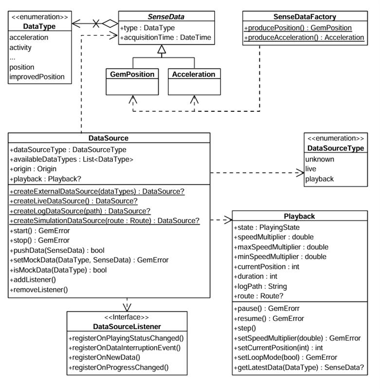
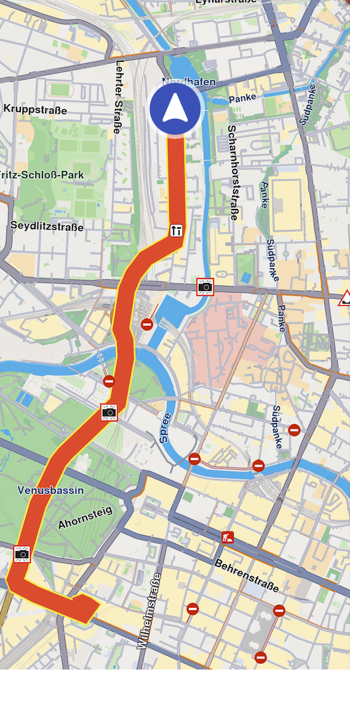

# Sensors and data sources

This section provides an overview of how the Maps Android SDK integrates with various sensors and external data sources to enhance map functionality and interactivity. From GPS and compass data to accelerometer readings and custom telemetry inputs, the SDK is designed to support a wide range of sensor-driven scenarios.

You'll learn how to access and configure these inputs, how the SDK responds to real-time changes, and how to incorporate your own data streams into the mapping experience. Whether you're building navigation apps, augmented reality layers, or location-aware services, this section will guide you through the sensor and data integration process.

## Sensor types[​](#sensor-types "Direct link to Sensor types")

The supported sensor data types can be summarized in the following table:

| **Type**              | **Description**            |
| --------------------- | ----------------------------------------------------------------------------------------------------------------------------------------------- |
| **Acceleration**      | Measures linear movement of the device in three-dimensional space. Useful for detecting motion, steps, or sudden changes in speed.              |
| **Activity**          | Represents user activity such as walking, running, or being stationary, typically inferred from motion data. Only available on Android devices. |
| **Attitude**          | Describes the orientation of the device in 3D space, often expressed as Euler angles or quaternions.                                            |
| **Battery**           | Provides battery status information such as charge level and power state.                                                                       |
| **Camera**            | Indicates data coming from or triggered by the device's camera, such as frames or detection events.                                             |
| **Compass**           | Gives directional heading relative to magnetic or true north using magnetometer data.                                                           |
| **Magnetic Field**    | Reports raw magnetic field strength, useful for environmental sensing or heading correction.                                                    |
| **Orientation**       | Combines multiple sensors (like accelerometer and magnetometer) to calculate absolute device orientation.                                       |
| **Position**          | Basic geographic position data, including latitude, longitude, and optionally altitude.                                                         |
| **Improved Position** | Enhanced position data that has been refined using filtering, correction services, or sensor fusion.                                            |
| **Gyroscope**         | Measures the rate of rotation around the device's axes, used to detect turns and angular movement.                                              |
| **Temperature**       | Provides temperature readings, either ambient or internal device temperature.                                                                   |
| **Notification**      | Represents external or system-level events that are not tied to physical sensors.                                                               |
| **Mount Information** | Describes how the device is physically mounted or oriented within a fixed system, such as in a vehicle.                                         |
| **Heart Rate**        | Biometric data representing beats per minute, typically from a fitness or health sensor.                                                        |
| **NMEA Chunk**        | Raw navigation data in NMEA sentence format, typically from GNSS receivers for high-precision tracking. Only available on Android devices.      |
| **Unknown**           | A fallback type used when the source of the data cannot be determined.                                                                          |

More details about the `UnlPositionData` and `ImprovedPositionData` classes are available [here](../03-Core/03-Positions.md).

> 🚨 **Danger**
>
> When using EDataType values, ensure that the specific types are supported on the target platform. Attempting to create data sources or recordings with unsupported types may result in failures.

## Working with data sources[​](#working-with-data-sources "Direct link to Working with data sources")

A simplified view of the main classes used to work with data sources can be seen in the following diagram:



DataSource

There are multiple possible data types, represented by the `EDataType` enum. Each sensor value is stored in a class that is derived from `UnlSenseData`. Two such classes are `UnlPositionData` and `UnlAccelerationData`.

If you want to create objects of these types, helper methods are provided in the companion objects of these classes. For example, `UnlPositionData.produce()` and `UnlAccelerationData.produce()` can create custom sensor data. In principle, this will only be necessary if you want to create a custom data source that will be fed with custom data.

You can create a `DataSource` by using one of the static methods in `DataSourceFactory`:

* `DataSourceFactory.produceLive()`: Creates a data source that collects data from the device's built-in sensors in real time. This is the most common use case for applications relying on actual sensor input.
* `DataSourceFactory.produceExternal(availableDataTypes)`: Creates a custom data source that accepts user-supplied data. You can feed data into this source via the `pushData` method.
* `DataSourceFactory.produceLog(path)`: Creates a data source that replays data from a previously recorded session (log file: gpx, nmea). This is useful for debugging, training, or offline data processing. See the [Recorder docs](../05-Positioning%20&%20Sensors/06-Recorder.md) for information about recording data.
* `DataSourceFactory.produceSimulation(route)`: Creates a data source that simulates movement along a specified route. It can be used for UI prototyping, testing, or feature validation without relying on real-world movement.

The first two types (live and external) are categorized under `EUnlDataSourceType.Live`, whereas the latter two (log and simulation) fall under `EUnlDataSourceType.Playback`.

> 📝 **Info**
>
> By default, a data source starts automatically upon creation. However, it's possible that it hasn't fully initialized by the time you obtain the data source object.
>
> If you add a `DataSourceListener` immediately after acquiring the data source, there's a chance you'll miss the initial "playing status changed" notification that indicates the data source has started - since it may already be in the started state when the listener is attached.

### Configuring and Controlling a Data Source[​](#configuring-and-controlling-a-data-source "Direct link to Configuring and Controlling a Data Source")

Once created, a data source can be stopped or started using the appropriate control methods:

* Kotlin
* Java

```kotlin
// Kotlin
dataSource.stop()
// ...
dataSource.start()

```

```java
// Java
dataSource.stop();
// ...
dataSource.start();

```

You can also configure a data source's behavior using methods like:

* `setPreferences()`: to set the sampling rate or data filtering behavior.
* `setMockData()`: to simulate sensor updates.

> 🚨 **Danger**
>
> The `setMockData()` method is only available for live data sources and supports only the `EDataType.Position` type. To mock other data types, use an external `DataSource`.

### Using `DataSourceListener`[​](#using-datasourcelistener "Direct link to using-datasourcelistener")

To receive updates from a data source, you can register a `DataSourceListener`. This listener allows you to react to various events such as:

* Changes in the playing status of the data source.
* Interruptions in data flow (e.g., sensor stopped, app went to background, etc.).
* New sensor data becoming available.
* Progress updates during playback.

You can create a listener using the `create` factory method and pass the appropriate callbacks:

* Kotlin
* Java

```kotlin
// Kotlin
val listener = DataSourceListener.create(
    onPlayingStatusChanged = { dataType, status ->
        println("Status for $dataType changed to $status")
    },
    onDataInterruptionEvent = { dataType, reason, ended ->
        println("Data interruption on $dataType: $reason. Ended: $ended")
    },
    onNewData = { data ->
        println("New data received: $data")
    },
    onProgressChanged = { progress ->
        println("Playback progress: $progress ms")
    }
)

```

```java
// Java
DataSourceListener listener = DataSourceListener.create(
    (dataType, status) -> {
        System.out.println("Status for " + dataType + " changed to " + status);
    },
    (dataType, reason, ended) -> {
        System.out.println("Data interruption on " + dataType + ": " + reason + ". Ended: " + ended);
    },
    (data) -> {
        System.out.println("New data received: " + data);
    },
    (progress) -> {
        System.out.println("Playback progress: " + progress + " ms");
    }
);

```

Once created, this listener can be registered with a `DataSource`, for a specific `EDataType` (in this case the position):

* Kotlin
* Java

```kotlin
// Kotlin
dataSource.addListener(listener, EDataType.Position)

```

```java
// Java
dataSource.addListener(listener, EDataType.Position);

```

Later, you can remove the listener when it's no longer needed:

* Kotlin
* Java

```kotlin
// Kotlin
dataSource.removeListener(listener, EDataType.Position)

```

```java
// Java
dataSource.removeListener(listener, EDataType.Position);

```

## Using the `Playback` interface[​](#using-the-playback-interface "Direct link to using-the-playback-interface")

The `Playback` interface allows you to control data sources that support playback functionality - specifically those of type `EUnlDataSourceType.Playback`, such as *log files* or *simulated route replays*. **It is not compatible with live or custom data sources**.

To access a `Playback` instance, you can check the type of the data source and retrieve it accordingly:

* Kotlin
* Java

```kotlin
// Kotlin
if (dataSource.dataSourceType == EUnlDataSourceType.Playback) {
    val playback = dataSource.playback

    playback?.pause()
    // ...
    playback?.resume()
}

```

```java
// Java
if (dataSource.getDataSourceType() == EUnlDataSourceType.Playback) {
    Playback playback = dataSource.getPlayback();

    if (playback != null) {
        playback.pause();
        // ...
        playback.resume();
    }
}

```

As shown above, playback-enabled data sources can be paused and resumed. Additionally, you can adjust the playback speed by setting a `speedMultiplier`, which must fall within the range defined by `playback.minSpeedMultiplier` and `playback.maxSpeedMultiplier`.

To control playback position, use `playback.currentPosition`, which represents the elapsed time in milliseconds from the beginning of the log or simulation. This allows you to skip to any point in the playback.

## Tracking positions[​](#tracking-positions "Direct link to Tracking positions")

Positions from a `DataSource` can be tracked on a map by rendering a marker polyline between relevant map points. This is done by using the `UnlMapView` methods directly.



Tracked path

The following code illustrates the functionality shown in the screenshot above.

* Kotlin
* Java

```kotlin
// Kotlin
SdkCall.execute {
    mapView.startTrackPositions(
        updatePositionMs = 500,
        settings = UnlMarkerCollectionRenderSettings(
            polylineInnerColor = Rgba(255, 0, 0, 255),
            polylineOuterColor = Rgba(255, 255, 0, 255)
        ),
        dataSource = dataSource
    )

    // other code ...

    mapView.stopTrackPositions()
}

```

```java
// Java
SdkCall.execute(() -> {
    mapView.startTrackPositions(
        500,
        new UnlMarkerCollectionRenderSettings(
            new Rgba(255, 0, 0, 255),
            new Rgba(255, 255, 0, 255)
        ),
        dataSource
    );

    // other code ...

    mapView.stopTrackPositions();
});

```

| **Method**          | **Parameters**        | **Return type**              |
| ----------------------- | ---------------------------------------------------------------------------------------------------------------------------------------------------------------------------------------------------------------------------------------------------------------------------------------------------------------- | ----------------------------------------- |
| **startTrackPositions** | - `updatePositionMs`: The tracked position collection update frequency in milliseconds. High frequency may decrease rendering performance on low-end devices<br />- `settings`: The markers collection rendering settings in the map view<br />- `dataSource`: The DataSource object whose positions are tracked | `UnlError`                                |
| **stopTrackPositions**  |                                                                                                                                                                                                                                                                                                                  | `UnlError`                                |
| **isTrackedPositions**  |                                                                                                                                                                                                                                                                                                                  | `Boolean`                                 |
| **getTrackedPositions** |                                                                                                                                                                                                                                                                                                                  | `Pair<ArrayList<UnlCoordinates>?, UnlError>` |

> 📝 **Info**
>
> If the `dataSource` parameter is left null, tracking will use the current `DataSource` set in `UnlPositionService`. If no `DataSource` is set in `UnlPositionService`, `UnlError.NotFound` will be returned.

### Getting tracked positions[​](#getting-tracked-positions "Direct link to Getting tracked positions")

After calling `UnlMapView.startTrackPositions()`, you can retrieve the tracked positions later using the `getTrackedPositions()` method. This method returns a pair containing a list of UnlCoordinates and a UnlError that indicates the success of the operation.

* Kotlin
* Java

```kotlin
// Kotlin
SdkCall.execute {
    val (trackedPositions, error) = mapView.getTrackedPositions()

    if (!UnlError.isError(error)) {
        // Use the tracked positions
        trackedPositions?.let { positions ->
            // Process the list of coordinates
        }
    }

    mapView.stopTrackPositions()
}

```

```java
// Java
SdkCall.execute(() -> {
    Pair<ArrayList<UnlCoordinates>, UnlError> result = mapView.getTrackedPositions();
    ArrayList<UnlCoordinates> trackedPositions = result.first;
    UnlError error = result.second;

    if (!UnlError.isError(error)) {
        // Use the tracked positions
        if (trackedPositions != null) {
            // Process the list of coordinates
        }
    }

    mapView.stopTrackPositions();
});

```

> 🚨 **Danger**
>
> Calling `getTrackedPositions()` **after** `stopTrackPositions()` is called will result in returning an empty list.
