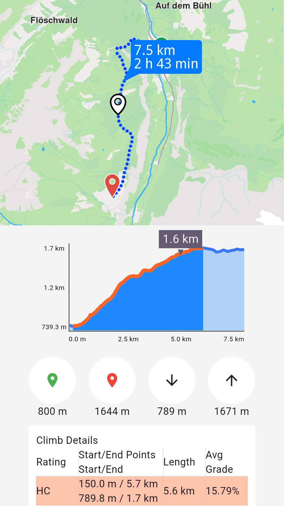
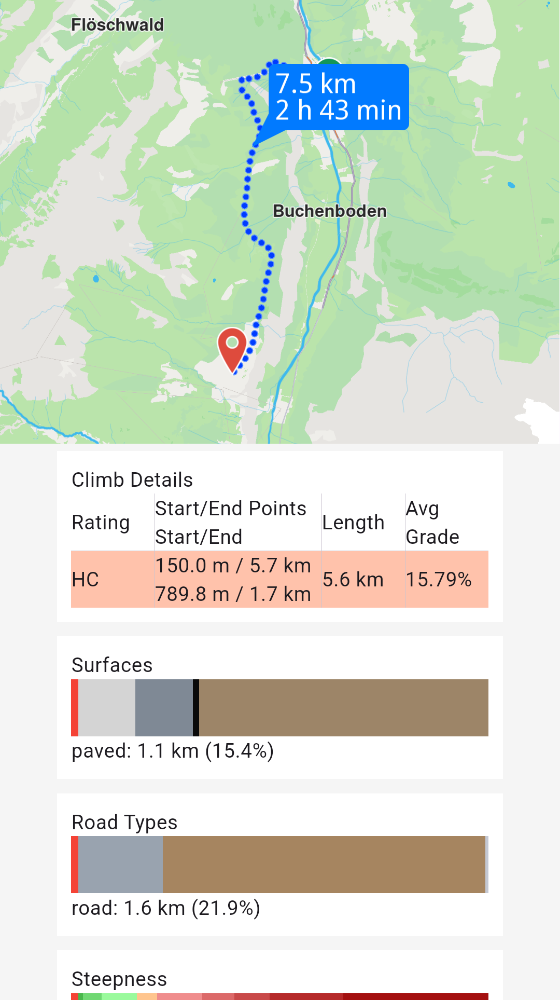
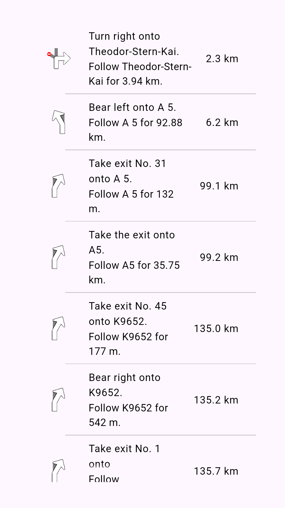

# Get started with routing

Here's a quick overview of what you can do with routing:

* Calculate routes from a start point to a destination.
* Include intermediary waypoints for multi-stop routes.
* Compute range routes to determine areas reachable within a specific range.
* Plan routes over predefined tracks.
* Customize routes with preferences like route types, restrictions, and more.
* Retrieve maneuvers and turn-by-turn instructions.
* Access detailed route profiles for further analysis.

## Calculate routes[​](#calculate-routes "Direct link to Calculate routes")

You can calculate a route with the code below. This route is navigable, which means that later it is possible to do a navigation/ simulation on it.

* Kotlin
* Java

```kotlin
// Kotlin
// Define the departure landmark
val departureLandmark = UnlLandmark().apply {
    coordinates = UnlCoordinates(48.85682, 2.34375)
}

// Define the destination landmark
val destinationLandmark = UnlLandmark().apply {
    coordinates = UnlCoordinates(50.84644, 4.34587)
}

// Define the route preferences (all default)
val routePreferences = UnlRoutePreferences()

// Create waypoints list
val waypoints = arrayListOf(departureLandmark, destinationLandmark)

// Create routing service
val routingService = UnlRoutingService(
    preferences = routePreferences,
    onCompleted = { routes, errorCode, hint ->
        if (errorCode == UnlError.Success) {
            Log.d("Routing", "Number of routes: ${routes.size}")
        } else if (errorCode == UnlError.Cancel) {
            Log.d("Routing", "UnlRoute computation canceled")
        } else {
            Log.e("Routing", "Error: $errorCode")
        }
    }
)

// Calculate the route
val result = routingService.calculateRoute(waypoints)

```

```java
// Java
// Define the departure landmark
UnlLandmark departureLandmark = new UnlLandmark();
departureLandmark.setCoordinates(new UnlCoordinates(48.85682, 2.34375));

// Define the destination landmark
UnlLandmark destinationLandmark = new UnlLandmark();
destinationLandmark.setCoordinates(new UnlCoordinates(50.84644, 4.34587));

// Define the route preferences (all default)
UnlRoutePreferences routePreferences = new UnlRoutePreferences();

// Create waypoints list
ArrayList<UnlLandmark> waypoints = new ArrayList<>();
waypoints.add(departureLandmark);
waypoints.add(destinationLandmark);

// Create routing service
UnlRoutingService routingService = new UnlRoutingService(
    routePreferences,
    (routes, errorCode, hint) -> {
        if (errorCode == UnlError.Success) {
            Log.d("Routing", "Number of routes: " + routes.size());
        } else if (errorCode == UnlError.Cancel) {
            Log.d("Routing", "UnlRoute computation canceled");
        } else {
            Log.e("Routing", "Error: " + errorCode);
        }
    }
);

// Calculate the route
int result = routingService.calculateRoute(waypoints);

```

> 📝 **INFO**
>
> The `UnlRoutingService.calculateRoute` method returns an `Int` status code. When the computation fails to initiate, the `onCompleted` callback will be triggered with the appropriate error code. You can call `UnlRoutingService.cancelRoute()` to cancel an ongoing route calculation.

The `errorCode` provided by the callback function can have the following values:

| Value                         | Significance                   |
| ----------------------------- | ----------------------------------------------------------------------------------------------------------------------------------------------------------------- |
| `UnlError.Success`            | successfully completed                                                                                                                                            |
| `UnlError.Cancel`             | cancelled by the user                                                                                                                                             |
| `UnlError.WaypointAccess`     | couldn't be found with the current preferences                                                                                                                    |
| `UnlError.ConnectionRequired` | if allowOnlineCalculation = false in the routing preferences and the calculation can't be done on the client side due to missing data                             |
| `UnlError.Expired`            | calculation can't be done on client side due to missing necessary data and the client world map data version is no longer supported by the online routing service |
| `UnlError.RouteTooLong`       | routing was executed on the online service and the operation took too much time to complete (usually more than 1 min, depending on the server overload state)     |
| `UnlError.Invalidated`        | the offline map data changed ( offline map downloaded, erased, updated ) during the calculation                                                                   |
| `UnlError.NoMemory`           | routing engine couldn't allocate the necessary memory for the calculation                                                                                         |

The previous example shows how to define your start and end points, set route preferences, and handle the callback for results. If needed, you can cancel the ongoing computation:

* Kotlin
* Java

```kotlin
// Kotlin
routingService.cancelRoute()

```

```java
// Java
routingService.cancelRoute();

```

When the route is canceled, the callback will return `errorCode` = `UnlError.Cancel`.

## Get ETA and traffic information[​](#get-eta-and-traffic-information "Direct link to Get ETA and traffic information")

Once the route is computed, you can retrieve additional details like the estimated time of arrival (ETA) and traffic information. Here's how you can access these:

* Kotlin
* Java

```kotlin
// Kotlin
val td = route.getTimeDistance(activePart = false)

val totalDistance = td?.totalDistance
// same with:
//val totalDistance = (td?.unrestrictedDistance ?: 0) + (td?.restrictedDistance ?: 0)

val totalDuration = td?.totalTime
// same with:
//val totalDuration = (td?.unrestrictedTime ?: 0) + (td?.restrictedTime ?: 0)

// by default activePart = true
val remainTd = route.getTimeDistance(activePart = true)

val totalRemainDistance = remainTd?.totalDistance
val totalRemainDuration = remainTd?.totalTime

```

```java
// Java
UnlTimeDistance td = route.getTimeDistance(false);

Integer totalDistance = td != null ? td.getTotalDistance() : null;
// same with:
//int totalDistance = (td != null ? td.getUnrestrictedDistance() : 0) + (td != null ? td.getRestrictedDistance() : 0);

Integer totalDuration = td != null ? td.getTotalTime() : null;
// same with:
//int totalDuration = (td != null ? td.getUnrestrictedTime() : 0) + (td != null ? td.getRestrictedTime() : 0);

// by default activePart = true
UnlTimeDistance remainTd = route.getTimeDistance(true);

Integer totalRemainDistance = remainTd != null ? remainTd.getTotalDistance() : null;
Integer totalRemainDuration = remainTd != null ? remainTd.getTotalTime() : null;

```

By using the method `UnlRoute.getTimeDistance` we can get the time and distance for a route. If the `activePart` parameter is `false`, it means the distance is computed for the entire route initially computed, otherwise it is computed only for the active part (the part still remaining to be navigated). The default value for this parameter is `true`.

In the example `unrestricted` means the part of the route that is on public property and `restricted` the part of the route that is on private property. UnlTime is measured in seconds and distance in meters.

If you want to gather traffic details, you can do so like this:

* Kotlin
* Java

```kotlin
// Kotlin
val trafficEvents = route.trafficEvents

trafficEvents?.forEach { event ->
    val transportMode = event.affectedTransportMode
    val description = event.description
    val eventClass = event.eventClass
    val eventSeverity = event.eventSeverity
    val from = event.from
    val to = event.to
    val isRoadBlock = event.isRoadblock()
}

```

```java
// Java
List<UnlTrafficEvent> trafficEvents = route.getTrafficEvents();

if (trafficEvents != null) {
    for (UnlTrafficEvent event : trafficEvents) {
        int transportMode = event.getAffectedTransportMode();
        String description = event.getDescription();
        int eventClass = event.getEventClass();
        int eventSeverity = event.getEventSeverity();
        UnlCoordinates from = event.getFrom();
        UnlCoordinates to = event.getTo();
        boolean isRoadBlock = event.isRoadblock();
    }
}

```

Check the [Traffic Events guide](../03-Core/10-Traffic%20Events.md) for more details.

## Display routes on map[​](#display-routes-on-map "Direct link to Display routes on map")

After calculating the routes, they are not automatically displayed on the map. To visualize and center the map on the route, refer to the [display routes on maps](../04-Maps/05-Display%20Map%20Items/05-Display%20Routes.md) related documentation. The Navigation SDK for Android offers extensive customization options, allowing for flexible preferences to tailor the display to your needs.

## Get the Terrain Profile[​](#get-the-terrain-profile "Direct link to Get the Terrain Profile")

When computing the route we can choose to also build the `TerrainProfile` for the route.

In order to do that `UnlRoutePreferences` must specify we want to also generate the terrain profile:

* Kotlin
* Java

```kotlin
// Kotlin
val routePreferences = UnlRoutePreferences().apply {
    buildTerrainProfile = true
}

```

```java
// Java
UnlRoutePreferences routePreferences = new UnlRoutePreferences();
routePreferences.setBuildTerrainProfile(true);

```

> 🚨 **DANGER**
>
> Setting the `buildTerrainProfile` property to `true` in the preferences used within `calculateRoute` is mandatory for getting route terrain profile data.

Later, use the profile for elevation data or other terrain-related details:

* Kotlin
* Java

```kotlin
// Kotlin
val terrainProfile = route.terrainProfile

terrainProfile?.let { profile ->
    val minElevation = profile.minElevation
    val maxElevation = profile.maxElevation
    val minElevDist = profile.minElevationDistance
    val maxElevDist = profile.maxElevationDistance
    val totalUp = profile.totalUp
    val totalDown = profile.totalDown

    // elevation at 100m from the route start
    val elevation = profile.getElevation(100)

    profile.roadTypeSections?.forEach { section ->
        val roadType = section.type
        val startDistance = section.startDistanceM
    }

    profile.surfaceSections?.forEach { section ->
        val surfaceType = section.type
        val startDistance = section.startDistanceM
    }

    profile.climbSections?.forEach { section ->
        val grade = section.grade
        val slope = section.slope
        val startDistanceM = section.startDistanceM
        val endDistanceM = section.endDistanceM
    }

    val categs = arrayListOf(-16f, -10f, -7f, -4f, -1f, 1f, 4f, 7f, 10f, 16f)

    val steepSections = profile.getSteepSections(categs)
    steepSections?.forEach { section ->
        val categ = section.category
        val startDistanceM = section.startDistanceM
    }
}

```

```java
// Java
TerrainProfile terrainProfile = route.getTerrainProfile();

if (terrainProfile != null) {
    int minElevation = terrainProfile.getMinElevation();
    int maxElevation = terrainProfile.getMaxElevation();
    int minElevDist = terrainProfile.getMinElevationDistance();
    int maxElevDist = terrainProfile.getMaxElevationDistance();
    int totalUp = terrainProfile.getTotalUp();
    int totalDown = terrainProfile.getTotalDown();

    // elevation at 100m from the route start
    int elevation = terrainProfile.getElevation(100);

    List<RoadTypeSection> roadTypeSections = terrainProfile.getRoadTypeSections();
    if (roadTypeSections != null) {
        for (RoadTypeSection section : roadTypeSections) {
            int roadType = section.getType();
            int startDistance = section.getStartDistanceM();
        }
    }

    List<SurfaceSection> surfaceSections = terrainProfile.getSurfaceSections();
    if (surfaceSections != null) {
        for (SurfaceSection section : surfaceSections) {
            int surfaceType = section.getType();
            int startDistance = section.getStartDistanceM();
        }
    }

    List<ClimbSection> climbSections = terrainProfile.getClimbSections();
    if (climbSections != null) {
        for (ClimbSection section : climbSections) {
            int grade = section.getGrade();
            float slope = section.getSlope();
            int startDistanceM = section.getStartDistanceM();
            int endDistanceM = section.getEndDistanceM();
        }
    }

    ArrayList<Float> categs = new ArrayList<>(Arrays.asList(-16f, -10f, -7f, -4f, -1f, 1f, 4f, 7f, 10f, 16f));

    List<SteepSection> steepSections = terrainProfile.getSteepSections(categs);
    if (steepSections != null) {
        for (SteepSection section : steepSections) {
            int categ = section.getCategory();
            int startDistanceM = section.getStartDistanceM();
        }
    }
}

```

`EUnlRoadType` possible values are: Motorways, StateRoad, Road, Street, Cycleway, Path, SingleTrack.

`EUnlSurfaceType` possible values are: Asphalt, Paved, Unpaved, Unknown.



Route profile chart



Route profile sections

<br />

## Get the route segments and instructions[​](#get-the-route-segments-and-instructions "Direct link to Get the route segments and instructions")

Once a route has been successfully computed, you can retrieve a detailed list of its `segments`. Each segment represents the portion of the route between two consecutive waypoints and includes its own set of `route instructions`.

For instance, if a route is computed with five waypoints, it will consist of four segments, each with distinct instructions.

In the case of public transit routes, segments can represent either pedestrian paths or public transit sections.

Here's an example of how to access and use this information, focusing on some key `UnlRouteInstruction` properties:

| Field                 | Type                   | Explanation              |
| ----------------------------------------- | ---------------------- | ------------------------------------------------------------------------------------------------------------------ |
| traveledTimeDistance                      | UnlTimeDistance?          | Time and distance from the beginning of the route.                                                                 |
| remainingTravelTimeDistance               | UnlTimeDistance?          | Time and distance to the end of the route.                                                                         |
| coordinates                               | UnlCoordinates?           | The coordinates indicating the location of the instruction.                                                        |
| remainingTravelTimeDistanceToNextWaypoint | UnlTimeDistance?          | Time and distance until the next waypoint.                                                                         |
| timeDistanceToNextTurn                    | UnlTimeDistance?          | Time and distance until the next instruction.                                                                      |
| turnDetails                               | UnlTurnDetails?           | Get full details for the turn.                                                                                     |
| turnInstruction                           | String?                | Get textual description for the turn.                                                                              |
| roadInfo                                  | ArrayList\<RoadInfo>?  | Get road information.                                                                                              |
| hasRoadInfo                               | Boolean                | Check if road information is available.                                                                            |
| followRoadInstruction                     | String?                | Get textual description for the follow road information.                                                           |
| hasFollowRoadInfo                         | Boolean                | Check if follow road information is available.                                                                     |
| countryCodeISO                            | String?                | Get ISO 3166-1 alpha-3 country code for the navigation instruction.                                                |
| hasSignpostInfo                           | Boolean                | Check if signpost information is available.                                                                        |
| signpostInstruction                       | String?                | Get textual description for the signpost information.                                                              |
| signpostDetails                           | SignpostDetails?       | Get extended signpost details.                                                                                     |
| hasTurnInfo                               | Boolean                | Check if turn information is available.                                                                            |
| turnImage                                 | UnlImage?                 | Get turn image. The user is responsible to check if the image is valid.                                            |
| realisticNextTurnImage                    | AbstractGeometryImage? | Get customizable image for the realistic turn information. The user is responsible to check if the image is valid. |
| roadInfoImage                             | RoadInfoImage?         | Get customizable road image. The user is responsible to check if the image is valid.                               |
| isFerry                                   | Boolean                | Returns true if the route instruction is a ferry.                                                                  |
| isTollRoad                                | Boolean                | Returns true if the route instruction is a toll road.                                                              |
| isCommon                                  | Boolean                | Check if this instruction is of common type.                                                                       |



List containing route instructions

Data from the instruction list above is obtained via the following properties of `UnlRouteInstruction`:

* `turnInstruction` : Bear left onto A 5.
* `followRoadInstruction` : Follow A 5 for 132m.
* `traveledTimeDistance?.totalDistance` : 6.2km. (after formatting to km)
* `turnDetails?.abstractGeometryImage?.asBitmap()` : Instruction image or null when image is invalid.
